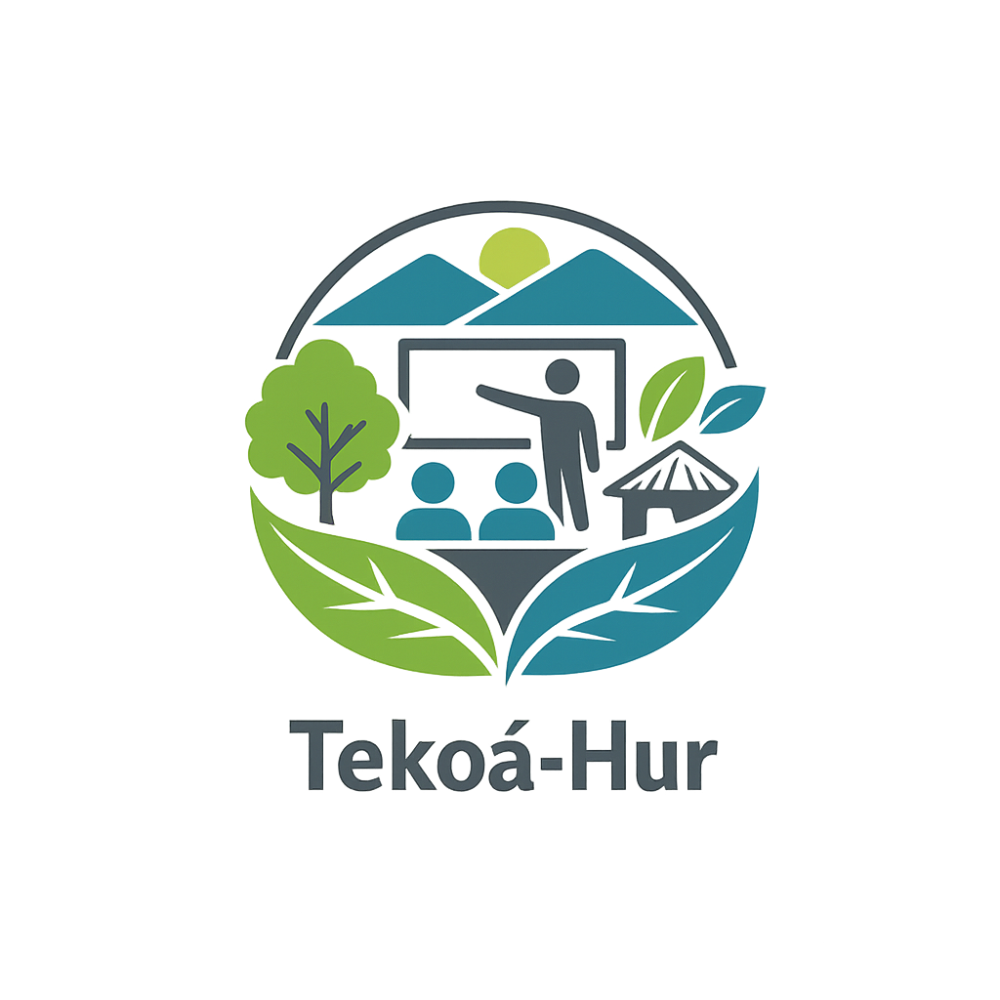

div align="center">
  

  # Tekoá-Hur — Documentación Técnica

  **Sistema de gestión académica**

  [](https://www.gnu.org/licenses/gpl-3.0)
  [](https://www.unahur.edu.ar)
  []()

</div>

---

## Descripción general

Tekoá-Hur es un sistema web desarrollado como **proyecto de grado** en la **Universidad Nacional de Hurlingham (UNAHUR)**. Cubre múltiples procesos académicos: registro de asistencia por QR, gestión de matrículas, reservas de aulas y espacios, importación de planillas Excel con auditoría, gestión de comisiones, horarios y feriados. Todo desde una plataforma centralizada con roles diferenciados (administrador, docente, estudiante).

El nombre *Tekoá* proviene del guaraní y significa *comunidad* o *aldea*, reflejando el espíritu colaborativo del proyecto.

---

## Repositorios del proyecto

| Repositorio | Descripción | Link |
|-------------|-------------|------|
| **Tekoa-Hur-Front** | Aplicación web — Next.js + TypeScript | [Ver repo](https://github.com/tekoa-hur/Tekoa-Hur-Front) |
| **Tekoa-Hur-Back**  | API REST — Node.js + Express + PostgreSQL | [Ver repo](https://github.com/tekoa-hur/Tekoa-Hur-Back) |
| **Tekoa-Hur-Doc**   | Este repositorio — Documentación técnica | [Ver repo](https://github.com/tekoa-hur/Tekoa-Hur-Doc) |

---

## Documentación disponible

| Documento | Descripción |
|-----------|-------------|
| [Arquitectura del sistema](docs/arquitectura.md) | Diagrama de 3 capas, flujo de datos, decisiones técnicas |
| [Documentación Frontend](docs/frontend.md) | Stack, estructura, rutas, componentes, variables de entorno |
| [Documentación Backend](docs/backend.md) | API REST, controllers, modelos, autenticación, Swagger |
| [Base de datos](docs/base-de-datos.md) | Entidades, relaciones, migraciones, seeders |
| [Guía de instalación](docs/instalacion.md) | Paso a paso para levantar el proyecto localmente |
| [Endpoints de la API](docs/api-endpoints.md) | Referencia completa de todos los endpoints REST |
| [DevOps — CI/CD y Docker](docs/devops.md) | GitHub Actions, Dockerfile, estrategia de ramas |
| [Flujo QR — Casos de uso](docs/flujo-qr.md) | Cómo funciona el sistema de asistencia con QR |
| [Seguridad](docs/seguridad.md) | Autenticación Basic Auth, roles, buenas prácticas |

---

## Integrantes

| Nombre | Rol |
|--------|-----|
| Miranda Tomás | Desarrollo Full Stack |
| Amarilla Silvia Adriana | Desarrollo Full Stack |
| Amarillo Juan Felipe Yamil | Desarrollo Full Stack |

---

## Stack tecnológico

```
Frontend:   Next.js 15 · React 19 · TypeScript · Tailwind CSS
Backend:    Node.js · Express · Sequelize ORM · Swagger UI
Base datos: PostgreSQL 14+
DevOps:     Docker · GitHub Actions · Git (rama develop)
Licencia:   GPL v3
```

---

## Inicio rápido

```bash
# 1. Clonar los repositorios
git clone https://github.com/tekoa-hur/Tekoa-Hur-Back.git
git clone https://github.com/tekoa-hur/Tekoa-Hur-Front.git

# 2. Configurar backend
cd Tekoa-Hur-Back
cp .env.ejemplo .env          # completar variables
npm install
npx sequelize-cli db:create
node sync.js
npx sequelize-cli db:seed:all
node index.js                 # → http://localhost:3001

# 3. Configurar frontend (en otra terminal)
cd Tekoa-Hur-Front
cp .env.example .env.local    # completar variables
npm install
npm run dev                   # → http://localhost:3000
```

> Documentación completa en [docs/instalacion.md](docs/instalacion.md)

---

## Licencia

Este proyecto se distribuye bajo los términos de la **[GNU General Public License v3.0](LICENSE)**.
El código fuente es libre: cualquier institución puede usarlo, modificarlo y redistribuirlo, siempre que mantenga la misma licencia.

---

<div align="center">
  <sub>Universidad Nacional de Hurlingham · Proyecto 2026</sub>
</div>